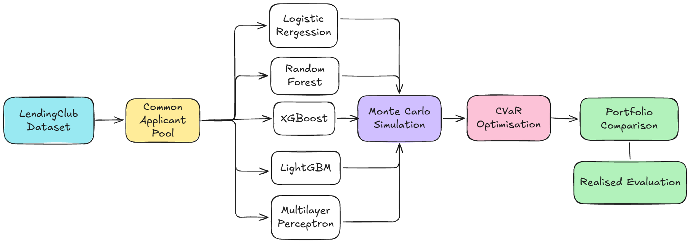
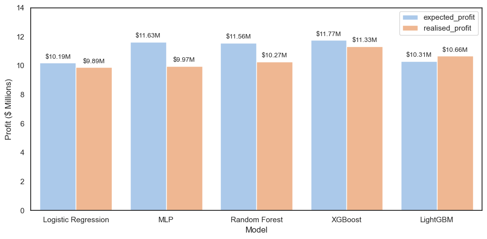
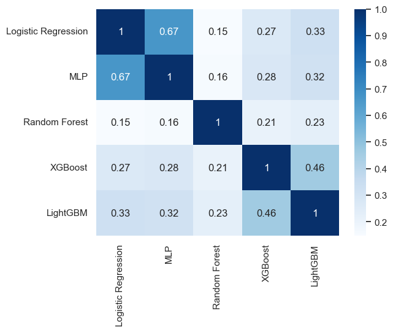

# PD Model Portfolio Optimisation

Probability of Default (PD) estimates are commonly used as inputs into credit risk and portfolio decision-making. This project investigates whether differences between PD models remain confined to predictive performance, or propagate into downstream credit portfolio decisions.

## Project Overview

This project follows the decision process from borrower-level PD estimation through to credit portfolio construction; exploring whether different modelling approaches result in different lending decisions. This includes:
- Development and comparison of five PD models:
    - Logistic Regression
    - Random Forest
    - XGBoost
    - LightGBM
    - Multi Layer Perceptron (MLP) Neural Network
- Model evaluation using ROC-AUC, Brier Score, Expected Calibration Error (ECE), and calibration curves
- Monte Carlo simulation of portfolio credit losses using model-generated PD estimates
- CVaR-constrained portfolio optimisation
- Comparison of portfolio composition, expected performance and realised outcomes across PD models

<p align='center'>
    
</p>

## Dataset

- **Source:** [LendingClub Loan Data (Kaggle)](https://www.kaggle.com/datasets/wordsforthewise/lending-club)
- **Description:** Historical consumer loan data containing borrower, credit and loan characteristics.
- **Size:** ~1.34 million loan observations
- **Target:** Binary loan outcome (`Fully Paid` / `Default`)

Note: *Only information that could reasonably have been available at or around the original lending decision was retained for modelling.*

## How To Run

**Requirements:**
- Python 3.x
- Libraries: `pandas`, `matplotlib`, `seabron`,`sklearn`, `feature-engine`, `xgboost`, `lightgbm`, `scipy`, `netcal`
- Any Jupyter notebook environment 

**Steps:**
1. Clone this repository
```
```

2. Optional: Install dependencies
```
pip install -r requirements.txt
```

3. Download the LendingClub dataset from [Kaggle](https://www.kaggle.com/datasets/wordsforthewise/lending-club) & add it to the project directory

4. Run the notebooks in this order:
    1. `01_eda.ipynb` (dataset construction & exploratory analysis)
    2. `02_modelling.ipynb` (PD model development & evaluation)
    3. `03_optimisaation.ipynb` (portfolio simulation & optimisation)

## Key Findings

**PD Modelling:**
- The five PD models produced relatively similar headline predictive performance, with ROC-AUC ranging from 0.713 - 0.729 and Brier Scores from 0.142 - 0.146.
- XGBoost produced the strongest overall predictive performance, achieving the highest ROC-AUC and strongest calibration.
- Despite similar aggregate performance, the models produced different borrower-level PD distributions, meaning that borrowers could receive different assessments of credit risk depending on the modelling approach used.

**Portfolio Optimisation:**
- Applying the model-generated PD estimates within the same optimisation framework resulted in substantially different lending portfolios.
- The resulting portfolios also differed in their expected risk, profitability and average predicted PD, demonstrating how differences originating at the prediction stage propagated into downstream financial decisions.
- XGBoost produced the strongest predictive performance and the highest expected and realised portfolio profit; however, this relationship was not consistent across all models.
    - Suggesting that stronger standalone predictive performance does not necessarily translate directly into stronger downstream portfolio outcomes.

<p align='center'>
    
</p>

- Pairwise portfolio similarity ranged from 0.15 - 0.67, showing that models with relatively similar predictive performance could select substantially different groups of borrowers.

<p align='center'>
    
</p>

Overall, the results demonstrate that evaluating PD models solely through predictive metrics can overlook meaningful differences in the lending decisions and financial outcomes their estimates ultimately support.

---

> Disclaimer: This project is for educational and research purposes only. It does not constitute financial or investment advice.